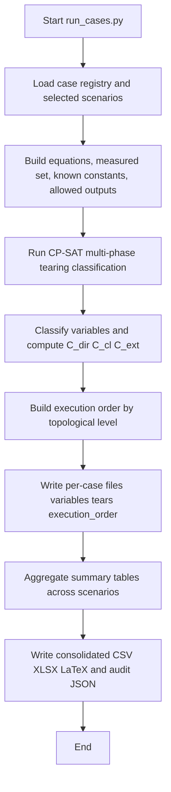

# CP-SAT Tearing

Final, reproducible CP-SAT pipeline for structural variable classification with closed tearing semantics.

## Motivation

Process monitoring and reconciliation workflows need to separate:
- what is directly measured;
- what is autonomously inferable in closed structure;
- what is only conditionally reachable through open tears.

This repository provides a deterministic and auditable CP-SAT implementation for that purpose.

## Problem formulation (high level)

Given equations and variables, the model:
- assigns at most one output variable per equation;
- allows local tears to break cyclic dependencies;
- classifies variables by structural status;
- reports complementary coverage metrics: `C_dir`, `C_cl`, `C_ext`.

## Method semantics (aligned with the paper)

The pipeline distinguishes three non-equivalent notions:

- `C_dir`: direct acyclic propagation coverage from measured variables and known constants.
- `C_cl`: closed/autonomous structural coverage, including closed tearing structures with no open external dependency.
- `C_ext`: conditional external reach, i.e., variables computable if open tears are provided as external inputs.

Operationally, this means a scenario can be:

- fully direct (`C_dir = |V|`);
- fully closed but not fully direct (`C_cl = |V|` and `C_dir < |V|`);
- only conditionally complete (`C_ext = |V|` and `C_cl < |V|`).

## Optimization and audit criteria

- The solver runs a deterministic multi-phase lexicographic procedure.
- Claims of optimality should rely on runs where all phases end with solver status `OPTIMAL`.
- The execution graph must be acyclic (`D_exec` as DAG) after removing local cut dependencies.
- Cyclic strongly connected components are audited on the full dependency graph (`D_full`).

## Where it was applied

Studied cases included in this package:
- URS mass-balance scenarios (ideal and real variants);
- URS stage KPI and bank KPI scenarios;
- Narasimhan steam plant;
- Sanchez and Romagnoli olefins plant.

## General result summary

At a high level, runs show:
- ideal URS case reaches full closed coverage (`C_cl = 43/43`);
- real URS variants expose conditional reach and open-tear dependence;
- selected added-measurement scenarios recover autonomous coverage;
- literature cases illustrate both fully closed and partially open structural regimes.

## What this repository does not claim

- This structural method does not prove algebraic uniqueness by itself.
- Closed tearing structures can still require numerical closure procedures.
- Algebraic diagnostics (for example QR/SVD/Jacobian checks) are complementary analyses outside this core pipeline.

## Relationship to Incidence and QR references

- Historical Incidence and QR values are treated as external reference diagnostics.
- This repository does not recompute those reference pipelines.
- Comparisons should be interpreted by semantics category, not as strict one-to-one equivalence of criteria.

## Reproduce

## Quick start

```bash
python3 -m pip install -r requirements.txt
python3 tests/test_tearing_semantics.py
python3 scripts/run_cases.py
```

Optional:

```bash
python3 scripts/run_matching_ablation.py
python3 scripts/run_time_benchmark.py --case 18_narasimhan --k 17 --n-samples 1000
```

## Execution flow



## Main command behavior

- `scripts/run_cases.py` is the core execution entrypoint.
- It solves each selected scenario and writes per-case and consolidated artifacts.
- It exports execution-order data automatically (no extra script required).
- It records topological execution levels and selected output equations for traceable calculation order.

## Outputs

Main audit artifacts are generated at:

- `results/run_YYYYMMDD_HHMMSS/consolidated/tearing_results_table.csv`
- `results/run_YYYYMMDD_HHMMSS/consolidated/tearing_results_table.xlsx`
- `results/run_YYYYMMDD_HHMMSS/consolidated/tearing_results_table.tex`
- `results/run_YYYYMMDD_HHMMSS/consolidated/auditoria.json`
- `results/run_YYYYMMDD_HHMMSS/consolidated/execution_order_summary.csv`

Per-case outputs also include:

- `results/run_YYYYMMDD_HHMMSS/<case_slug>/execution_order.csv`

## About paper LaTeX results

The script `scripts/run_cases.py` generates the CP-SAT consolidated LaTeX table used as the reproducible source for the CP-SAT result block:
- `tearing_results_table.tex`

Historical Incidence/QR comparison numbers are reference baselines in the case definitions, not recomputed by this solver.

## Full technical documentation

See `docs/README.tex` for the full formulation, semantics, execution guide, and audit interpretation.

## Reference repository

- Public reproduction repository: [romulobrito/cp-sat-tearing](https://github.com/romulobrito/cp-sat-tearing)
